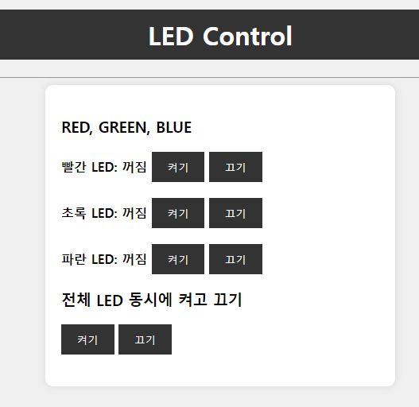

# LED 컨트롤러

## 소개
이것은 빨간색, 초록색 및 파란색 LED를 제어할 수 있는 간단한 LED 컨트롤러 웹 애플리케이션입니다. 제공된 버튼을 사용하여 LED를 개별적으로 켜거나 끌 수 있으며, 모든 LED를 동시에 제어할 수 있습니다.

## 사용된 기술
- HTML
- CSS
- Python (백엔드로 Flask를 사용하는 것으로 가정합니다)

## 미리보기

## 사용 방법
- 각 LED 상태 옆의 "켜기" 버튼을 클릭하여 켜세요.
- 끄기를 하려면 "끄기" 버튼을 클릭하세요.
- "전체 LED 동시에 켜고 끄기" 버튼을 사용하여 모든 LED를 한 번에 제어하세요.

## 설정
1. 이 저장소를 로컬 머신에 복제하세요.
2. Python과 Flask가 설치되어 있는지 확인하세요.
3. Python 애플리케이션을 실행하여 LED를 제어하세요.

